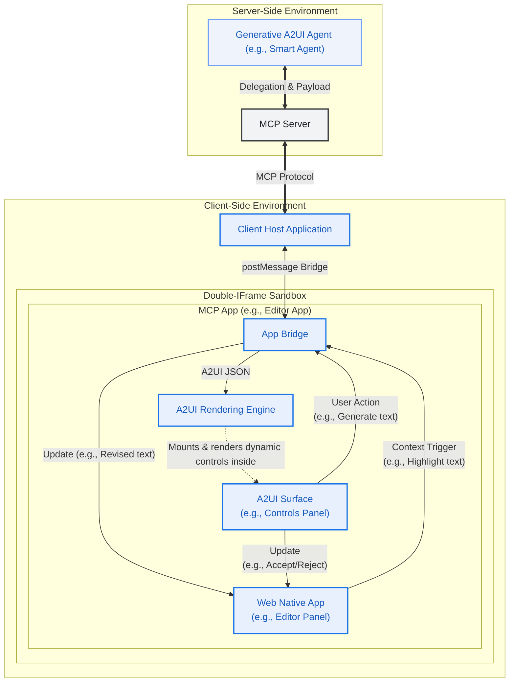
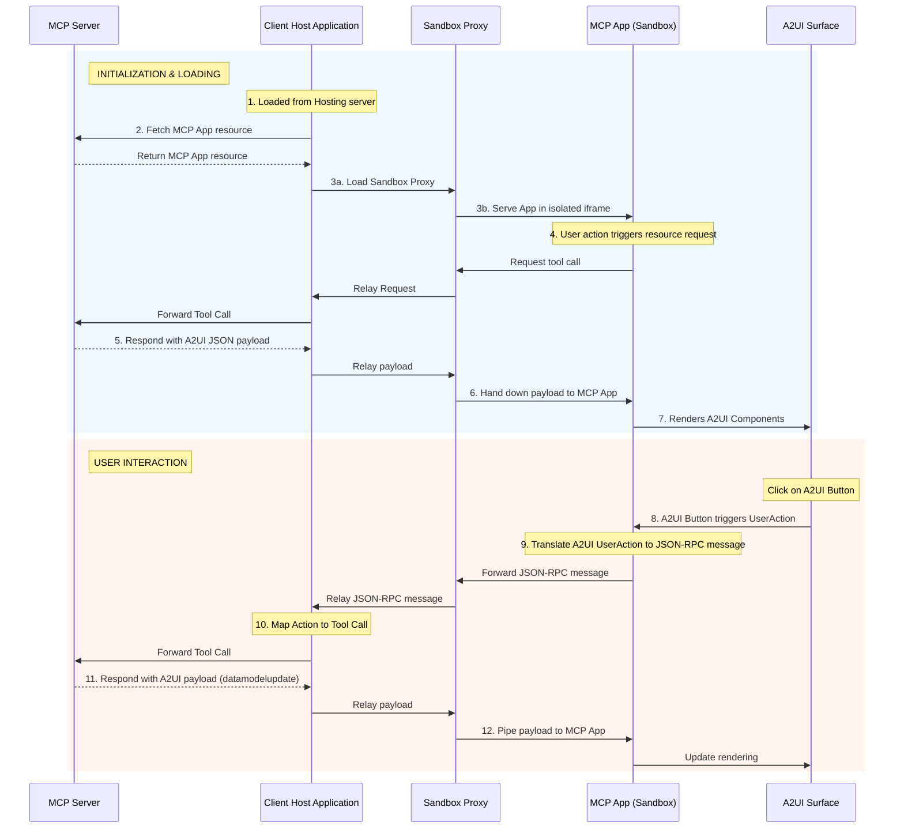

# MCP Application 안에서 A2UI 동적 렌더링

이 가이드는 Tools와 Embedded Resources를 사용해 [MCP Apps](https://modelcontextprotocol.io/extensions/apps/overview) 안에서 풍부하고 인터랙티브한 A2UI 인터페이스를 제공하는 방법을 보여 줍니다. 끝까지 따라 하면 A2UI 컴포넌트를 렌더링하고 A2UI 상호작용을 처리할 수 있는 MCP App을 반환하는 MCP server를 갖게 됩니다. MCP Apps 안에서 native A2UI를 지원하면 MCP server가 UI 스타일 일관성을 유지하면서 원격 에이전트와 안전하게 협업할 수 있습니다.


## 사전 요구사항

- **[Python 3.10+](https://www.python.org/)**
- **[uv](https://docs.astral.sh/uv/)** — 빠른 Python 패키지 관리자
- **[Node.js 18+](https://nodejs.org/)** (MCP Inspector용)

## Quick Start: 샘플 실행

이 샘플을 실행하는 자세한 방법은 [README.md](https://github.com/google/A2UI/blob/main/samples/mcp/a2ui-in-mcpapps/README.md)를 참고하세요.

## 아키텍처 개요

이 시스템은 통신 체인을 통해 상호작용하는 세 주요 actor로 구성됩니다.

1.  **클라이언트 호스트 애플리케이션**: MCP Server에 연결하고 MCP App을 위한 안전한 sandbox를 host하는 외부 컨테이너입니다(예: Angular app).
2.  **MCP Application (Sandboxed)**: double-iframe sandbox 안에서 실행되는 신뢰할 수 없는 서드파티 웹 애플리케이션입니다(예: Lit 또는 Angular micro-app). 이 app은 A2UI surface를 포함합니다.
3.  **MCP Server**: 애플리케이션 리소스를 제공하고 tool call을 처리하는 backend server입니다.



## 심층 분석: 통신 흐름

이 패턴의 핵심은 **MCP App**이 A2UI payload를 직접 렌더링한다는 점입니다. Client Host Application에 렌더링을 의존하지 않습니다.

### MCP Apps에서 A2UI 컴포넌트 로드

MCP Apps 안에 A2UI 컴포넌트를 동적으로 로드하는 이벤트 순서는 다음과 같습니다.

1.  **Trigger**: MCP App이 UI 콘텐츠를 가져오거나 업데이트해야 한다고 판단합니다(예: 초기화 또는 사용자 시작 Action).
2.  **Request**: MCP App이 `window.parent.postMessage`를 통해 Host로 JSON-RPC 요청을 보냅니다.
    - _Example Method_: `ui/fetch_counter_a2ui`
3.  **Relay**: Sandbox Proxy가 이 메시지를 Client Host로 relay합니다.
4.  **MCP Call**: Client Host가 이 custom message를 MCP Server로 보내는 표준 MCP `tools/call` 요청으로 변환합니다.
    - _Example Tool_: `fetch_counter_a2ui`
5.  **Response**: MCP Server가 tool을 실행하고 `application/json+a2ui` resource가 포함된 result를 반환합니다.
6.  **응답 전달**: Host가 tool result를 받아 Sandbox Proxy를 통해 MCP App으로 다시 전달합니다.
7.  **Rendering**: MCP App이 resource에서 A2UI JSON payload를 추출하고 로컬 A2UI `MessageProcessor`에 전달하여 A2UI surface를 동적으로 업데이트합니다.

### 사용자 액션 처리

렌더링된 A2UI surface 안의 상호작용은 흐름을 반대로 돌려 처리합니다.

1.  사용자가 MCP App 안의 A2UI surface에서 버튼을 클릭합니다.
2.  A2UI 컴포넌트가 `userAction`을 트리거합니다.
3.  MCP App이 A2UI `MessageProcessor.events` 구독을 통해 이 event를 캡처합니다.
4.  MCP App이 action을 패키징해 Host로 JSON-RPC 메시지를 보냅니다(예: `ui/increase_counter`).
5.  Host가 MCP Server의 해당 tool을 호출합니다.
6.  Server가 업데이트된 상태를 나타내는 새 A2UI payload를 반환하고, 이 payload가 MCP App으로 다시 pipe되어 렌더링을 업데이트합니다.

### Sequence Diagram



## 구현 방법

A2UI 기능을 갖춘 자체 MCP App을 만들려면 다음 단계를 따르세요.

### Step 1: 렌더러 인라인화

MCP Apps는 일반적으로 MCP Server에서 단일 HTML resource로 전달됩니다. Angular나 React 같은 현대적 프레임워크로 이를 구현하려면 다음을 수행합니다.

1.  애플리케이션을 일반적인 방식으로 빌드하여 static assets(`index.html`, `.js`, `.css`)를 생성합니다.
2.  샘플의 [`inline.js`](https://github.com/google/A2UI/blob/main/samples/mcp/a2ui-in-mcpapps/server/apps/src/inline.js) 스크립트 같은 post-build script를 사용해 `index.html`을 읽고 외부 `<script src="...">` 및 `<link rel="stylesheet" href="...">` 태그를 실제 파일 내용을 담은 inline `<script>` 및 `<style>` 태그로 교체합니다.
3.  제한된 iframe에서 `srcdoc`으로 안전하게 로드할 수 있는 self-contained HTML 파일이 만들어집니다.

> [!TIP]
> **Vite로 inline 처리하기**
>
> 프로젝트가 Vite를 사용한다면(React, Vue, Lit에서 일반적), `vite-plugin-singlefile` 같은 플러그인을 사용해 동일한 single-file 출력을 자동으로 만들 수 있습니다. 이 플러그인은 빌드 과정에서 inline 처리를 수행하므로 custom post-build script가 필요 없습니다.
>
> **사용 방법:**
>
> 1. **플러그인 설치**:
>
>     ```bash
>     npm install -D vite-plugin-singlefile
>     ```
>
> 2. **Vite 설정**: `vite.config.ts`(또는 `.js`)에 플러그인을 추가합니다.
>
>     ```typescript
>     import {defineConfig} from 'vite';
>     import {viteSingleFile} from 'vite-plugin-singlefile';
>
>     export default defineConfig({
>       plugins: [viteSingleFile()],
>     });
>     ```
>
>     이렇게 하면 빌드 시 모든 JS 및 CSS asset이 `index.html` 파일에 inline되어, MCP server가 단일 resource로 제공할 준비가 됩니다.

### Step 2: A2UI-over-MCP 활용

인라인된 app은 이제 sandbox 안에서 실행됩니다. A2UI를 활용하려면 다음을 수행합니다.

1.  app bundle에 **A2UI Angular/Lit 라이브러리**를 포함합니다.
2.  MCP Server와 상호작용하기 위해 Host와의 **통신 계약**을 정의합니다.
3.  Host에서 응답을 받으면 content 안의 `application/json+a2ui` mimeType을 찾습니다.
4.  JSON text를 파싱하고 A2UI [`MessageProcessor`](https://github.com/google/A2UI/blob/main/renderers/angular/src/v0_8/data/processor.ts)에 전달합니다.

**예시: A2UI 가져오기 및 렌더링**

```typescript
// 1. Request A2UI data from Host
const result = await callHostMethod('ui/fetch_counter_a2ui');

// 2. Find and parse the A2UI resource
const a2uiResource = result.find(
  c => c.type === 'resource' && c.resource?.mimeType === 'application/json+a2ui',
);

if (a2uiResource?.resource?.text) {
  const messages = JSON.parse(a2uiResource.resource.text);
  this.processor.processMessages(messages);
}

// Utility for JSON-RPC communication
function callHostMethod(method: string, params: any = {}): Promise<any> {
  return new Promise((resolve, reject) => {
    const requestId = `${method}-${Date.now()}`;

    const handler = (event: MessageEvent) => {
      if (event.data.id !== requestId) return;
      window.removeEventListener('message', handler);

      if (event.data.error) {
        reject(event.data.error);
      } else {
        resolve(event.data.result);
      }
    };

    window.addEventListener('message', handler);

    window.parent.postMessage(
      {
        jsonrpc: '2.0',
        id: requestId,
        method,
        params,
      },
      '*',
    ); // Note: Replace "*" with explicit target origin in production
  });
}
```

### Step 3: A2UI 컴포넌트의 사용자 액션 처리

렌더링된 A2UI surface 안의 상호작용을 처리하려면 MCP App이 A2UI event를 캡처하고 JSON-RPC를 사용해 Host로 전달해야 합니다.

**예시: 사용자 액션 처리**

```typescript
// Subscribing to A2UI events in the MCP App ([main.ts](https://github.com/google/A2UI/blob/main/samples/mcp/a2ui-in-mcpapps/server/apps/src/src/main.ts))
this.processor.events.subscribe(async event => {
  if (!event.message.userAction) return;

  const method = `ui/${event.message.userAction.name}`;
  const params = event.message.userAction.context;

  try {
    // Translate A2UI UserAction to JSON-RPC, send to Host, and await response
    const result = await callHostMethod(method, params);

    // Parse the updated A2UI payload and update the rendering
    const messages = extractA2UIMessages(result);
    if (messages) {
      this.processor.processMessages(messages);
    }
  } catch (error) {
    console.error(`Error handling user action[${method}]:`, error);
  }
});
```

이 패턴을 사용하면 MCP App이 엄격한 보안 격리를 유지하면서 MCP Server의 A2UI 기능을 위한 동적 인터페이스 역할을 할 수 있습니다.

### Inlined MCP App HTML Pseudocode

전체를 합치면, 다음은 컴파일되고 inline된 MCP Application을 나타내는 HTML mockup입니다. native `<a2ui-surface>` 요소가 있는 placeholder UI를 정의하고, 외부 host와 통신하기 위해 `AppBridge`를 초기화하며, 로드 시 dynamic A2UI layout을 가져오고, 로드된 A2UI SDK를 사용해 event를 처리합니다.

```html
<!DOCTYPE html>
<html lang="en">
  <head>
    <meta charset="UTF-8" />
    <title>Inlined MCP App Surface</title>
    <!-- Assumes the standard A2UI SDK script is bundled or loaded -->
  </head>
  <body>
    <div>
      <h3>MCP App (Editor Panel)</h3>
      <p>This text is native to the sandboxed third-party app.</p>

      <!-- A2UI Surface custom element provided by the A2UI SDK -->
      <a2ui-surface surfaceId="recipe-card"></a2ui-surface>
    </div>

    <script>
      // Note: The pseudocode below assumes AppBridge from @modelcontextprotocol/ext-apps
      // and a2uiProcessor from the A2UI SDK are preloaded or inlined.
      const bridge = new AppBridge({name: 'editor-panel', version: '1.0.0'});

      // Helper to extract and process dynamic A2UI responses from tool results
      function processA2UIResponse(result) {
        const a2uiResource = result?.content?.find(
          c => c.type === 'resource' && c.resource?.mimeType === 'application/json+a2ui',
        );
        if (a2uiResource?.resource?.text) {
          const payload = JSON.parse(a2uiResource.resource.text);
          window.a2uiProcessor.processMessages(payload);
        }
      }

      // 1. Initialize AppBridge and fetch initial controls
      async function initApp() {
        await bridge.connect();

        // Call server tool to load initial layout controls
        const result = await bridge.callServerTool({name: 'fetch_controls', arguments: {}});
        processA2UIResponse(result);
      }

      // 2. Handle interactive User Actions routed by the A2UI SDK
      window.a2uiProcessor.events.subscribe(async event => {
        if (!event.message.userAction) return;
        const action = event.message.userAction;

        // Route the user action directly via the bridge to the MCP Server tool
        const result = await bridge.callServerTool({
          name: action.name,
          arguments: action.context,
        });

        // Feed any updated server UI states back to the A2UI processor
        processA2UIResponse(result);
      });

      // Initialize the app on startup
      initApp();
    </script>
  </body>
</html>
```

## 보안 고려사항

- **명시적 Target Origin**: host origin을 알고 있다면 `postMessage`를 호출할 때 항상 `*` 대신 특정 target origin(예: `'https://trusted-host.com'`)을 사용하세요. 이렇게 하면 악성 iframe이 RPC 요청을 가로채는 것을 방지할 수 있습니다.
- **Null Origin 처리**: 엄격한 sandbox(`allow-same-origin` 없이 `sandbox="allow-scripts"`) 안에서는 `window.location.origin`이 `"null"`로 평가된다는 점을 기억하세요. `event.source`를 예상 window object(예: `window.parent`)와 비교하여 들어오는 메시지를 신중하게 검증해야 합니다.
