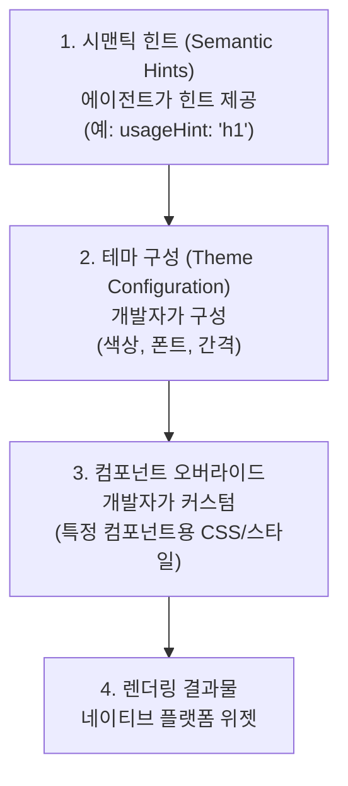

# 테마 및 스타일링

브랜드에 맞게 A2UI 컴포넌트의 룩앤필(look and feel)을 커스터마이징하세요.

## A2UI 스타일링 철학

A2UI는 **클라이언트 제어 스타일링** 방식을 따릅니다:

- **에이전트는 *무엇을* 보여줄지** 설명합니다(컴포넌트 및 구조).
- **클라이언트는 어떻게 보일지** 결정합니다(색상, 폰트, 간격 등).

이러한 방식은 다음을 보장합니다:

- ✅ **브랜드 일관성**: 모든 UI가 앱의 디자인 시스템과 일치합니다.
- ✅ **보안**: 에이전트가 임의의 CSS나 스타일을 주입할 수 없습니다.
- ✅ **접근성**: 대비, 포커스 상태, ARIA 속성을 클라이언트가 직접 제어합니다.
- ✅ **플랫폼 네이티브 느낌**: 웹 앱은 웹스럽게, 모바일은 모바일스럽게 보입니다.

## 스타일링 계층

A2UI 스타일링은 계층적으로 작동합니다:



## 계층 1: 시맨틱 힌트

에이전트는 시각적 스타일이 아닌 시맨틱 힌트를 제공하여 클라이언트 렌더링을 가이드합니다:

```json
{
  "id": "title",
  "component": {
    "Text": {
      "text": {"literalString": "환영합니다"},
      "usageHint": "h1"
    }
  }
}
```

**공통 `usageHint` 값:**
- Text: `h1`, `h2`, `h3`, `h4`, `h5`, `body`, `caption`
- 다른 컴포넌트들도 각자의 힌트를 가지고 있습니다 ([컴포넌트 레퍼런스](../reference/components.md) 참조).

클라이언트 렌더러는 여러분의 테마와 디자인 시스템을 기반으로 이러한 시맨틱 힌트를 실제 시각적 스타일에 매핑합니다.

## 계층 2: 테마 구성

각 렌더러는 다음을 포함하여 디자인 시스템을 전역적으로 구성할 수 있는 방법을 제공합니다:

- **색상 (Colors)**: Primary, secondary, background, surface, error, success 등
- **타이포그래피 (Typography)**: 폰트 패밀리, 크기, 굵기, 행간
- **간격 (Spacing)**: 기본 단위 및 스케일 (xs, sm, md, lg, xl)
- **모양 (Shapes)**: 테두리 반경(border radius) 값
- **입체감 (Elevation)**: 깊이감을 위한 그림자 스타일

TODO: 각 플랫폼별 테마 설정 가이드 추가 예정:

**웹 (Lit):**
- 렌더러 초기화 시 테마 구성 방법
- 사용 가능한 테마 속성 목록

**Angular:**
- Angular Material 테마와의 통합 방법
- 독립형 A2UI 테마 구성

**Flutter:**
- A2UI가 Flutter의 `ThemeData`를 사용하는 방식
- 커스텀 테마 속성

**실행 가능한 예시:**
- [Lit 샘플](https://github.com/google/a2ui/tree/main/samples/client/lit)
- [Angular 샘플](https://github.com/google/a2ui/tree/main/samples/client/angular)
- [Flutter GenUI 문서](https://docs.flutter.dev/ai/genui)

## 계층 3: 컴포넌트 오버라이드

전역 테마 외에도 특정 컴포넌트의 스타일을 오버라이드할 수 있습니다:

**웹 렌더러:**
- 정밀한 제어를 위한 CSS 커스텀 속성 (CSS 변수) 사용
- 특정 컴포넌트 오버라이드를 위한 표준 CSS 선택자 사용

**Flutter:**
- `ThemeData`를 통한 위젯별 테마 오버라이드

TODO: 각 플랫폼별 컴포넌트 오버라이드 상세 예제 추가 예정.

## 주요 스타일링 기능

### 다크 모드

A2UI 렌더러는 일반적으로 시스템 설정에 따른 자동 다크 모드를 지원합니다:

- 시스템 테마 자동 감지 (`prefers-color-scheme`)
- 수동 라이트/다크 테마 선택
- 커스텀 다크 테마 구성

TODO: 다크 모드 설정 예제 추가 예정.

### 반응형 디자인

A2UI 컴포넌트는 기본적으로 반응형입니다. 반응형 동작을 더 세밀하게 커스터마이징할 수 있습니다:

- 다양한 화면 크기에 따른 미디어 쿼리 적용
- 컴포넌트 수준의 반응형 대응을 위한 컨테이너 쿼리
- 반응형 간격 및 타이포그래피 스케일

TODO: 반응형 디자인 예제 추가 예정.

### 커스텀 폰트

A2UI 애플리케이션에서 커스텀 폰트를 로드하고 사용하세요:

- 웹 폰트 (Google Fonts 등)
- 직접 호스팅하는 폰트
- 플랫폼별 폰트 로딩 방식

TODO: 커스텀 폰트 예제 추가 예정.

## 베스트 프랙티스

### 1. 시각적 속성이 아닌 시맨틱 힌트를 사용하세요

에이전트는 시각적 스타일이 아닌 시맨틱 힌트(`usageHint`)만 제공해야 합니다:

```json
// ✅ 좋은 예: 시맨틱 힌트 사용
{
  "component": {
    "Text": {
      "text": {"literalString": "환영합니다"},
      "usageHint": "h1"
    }
  }
}

// ❌ 나쁜 예: 시각적 속성 사용 (지원되지 않음)
{
  "component": {
    "Text": {
      "text": {"literalString": "환영합니다"},
      "fontSize": 24,
      "color": "#FF0000"
    }
  }
}
```

### 2. 접근성 유지

- 충분한 색상 대비 보장 (WCAG AA: 일반 텍스트 4.5:1, 큰 텍스트 3:1)
- 스크린 리더 테스트 수행
- 키보드 탐색 지원
- 라이트 및 다크 모드 모두에서 테스트

### 3. 디자인 토큰(Design Tokens) 활용

색상, 간격 등 재사용 가능한 디자인 토큰을 정의하고, 일관성을 위해 전체 스타일에서 이를 참조하세요.

### 4. 크로스 플랫폼 테스트

- 모든 대상 플랫폼(웹, 모바일, 데스크톱)에서 테마를 테스트하세요.
- 라이트 및 다크 모드 모두 확인하세요.
- 다양한 화면 크기와 방향을 확인하세요.
- 플랫폼 간 일관된 브랜드 경험을 보장하세요.

## 다음 단계

- **[커스텀 컴포넌트](custom-components.md)**: 여러분의 스타일에 맞춘 커스텀 컴포넌트 빌드
- **[컴포넌트 레퍼런스](../reference/components.md)**: 모든 컴포넌트의 스타일링 옵션 확인
- **[클라이언트 설정](client-setup.md)**: 앱에 렌더러 설정하기
