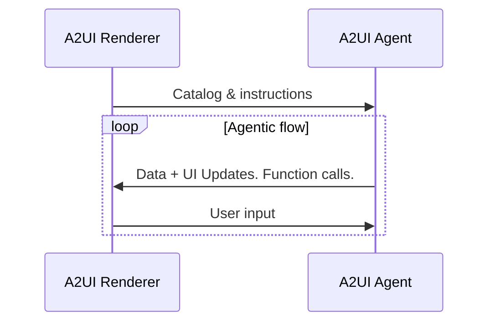
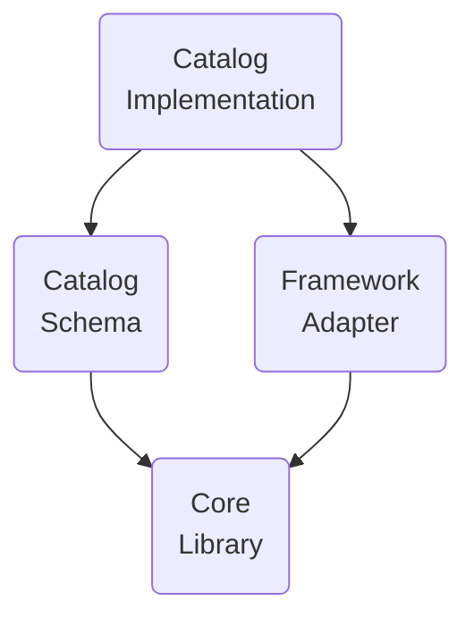

# 용어집

## A2UI 프로토콜 용어

A2UI 프로토콜에서 요구되는 용어입니다.

### A2UI 에이전트와 A2UI 렌더러

A2UI 프로토콜은 **에이전트**와 **렌더러** 사이의 대화를 가능하게 합니다.

1. **렌더러**는 A2UI 카탈로그 형태의 **UI 기능**과 그 사용 방법에 대한 **지침**을 제공합니다.
2. **에이전트**는 다음 루프를 반복합니다.
    - 받은 카탈로그를 고려하여 호출할 **UI**와 **함수**를 제공합니다.
    - 렌더러가 전달한 **사용자 입력**을 받습니다.
    - UI에 표시할 **데이터**를 업데이트합니다.

이 프로토콜은 **AI 기반 에이전트**를 위해 설계되었지만, 결정론적인 에이전트와도 함께 동작할 수 있습니다. 예를 들어 에이전트가 미리 준비된 A2UI UI를 반환할 수 있습니다.

에이전트가 stateless이거나 카탈로그 보존을 보장하지 않는 경우, 렌더러는 모든 메시지에 카탈로그를 함께 제공해야 합니다.

또 어떤 경우에는 에이전트가 미리 정의된 카탈로그를 사용하기 때문에, 렌더러는 해당 카탈로그를 지원하거나 어댑터를 사용해야 합니다.

### GenUI 컴포넌트

에이전트가 사용할 수 있도록 허용된 UI 컴포넌트입니다. 예: date picker, carousel, button, hotel selector.

### Catalog

1. 항목화된 렌더러 기능입니다.
    - 에이전트가 UI를 생성할 때 사용할 수 있는 컴포넌트 목록
    - 렌더러가 호출할 수 있는 함수 목록
    - 스타일과 테마
2. 렌더러 기능을 어떻게 사용해야 하는지에 대한 설명입니다.

사용 사례에 따라 카탈로그 컴포넌트는 도메인에 더 적거나 더 많이 특화될 수 있습니다.

- **덜 특화된 경우**:

    버튼, 라벨, 행, 열, 옵션 선택기 같은 기본 UI primitive입니다.

- **더 특화된 경우**:

    `HotelCheckout` 또는 `FlightSelector` 같은 컴포넌트입니다.

### Basic Catalog

A2UI를 빠르게 시작할 수 있도록 A2UI 팀이 유지 관리하는 카탈로그입니다.

[basic catalog](../specification/v1_0/catalogs/basic/catalog.json)를 참고하세요.

### Catalog Transformer

시스템 프롬프트 지시문이 생성되거나 페이로드 검증 스키마가 컴파일되기 전에, 원본 그대로의 **Catalog**를 프로그래밍 방식으로 필터링·조정·변형하는 규칙 집합입니다.

#### Catalog Transformer가 필요한 이유

카탈로그는 렌더러가 지원하는 모든 UI 컴포넌트와 함수의 완전한 명세를 제공하지만, 에이전트 구현에서는 특정 용도에 맞게 카탈로그를 잘라내거나 제한해야 하는 경우가 많습니다.

- **컨텍스트 윈도 토큰 최적화**: 카탈로그는 수십 개의 컴포넌트와 로직 함수를 정의할 수 있습니다. 모든 컴포넌트의 JSON 스키마를 LLM의 시스템 프롬프트에 주입하면 컨텍스트 윈도 토큰을 크게 소모하고, 프롬프트 지연 시간이 늘어나며, LLM 추론 비용이 커집니다. 가지치기(pruning) 트랜스포머는 시스템 프롬프트 지시문을 해당 에이전트의 도메인 작업과 관련된 컴포넌트로만 제한합니다.
- **작업별 기능 가드레일**: 특정 에이전트 워크플로나 보안 역할에서는 상호작용 기능을 제한해야 할 수 있습니다(예: 게스트 모드에서 표시용 카드와 텍스트는 허용하되 폼 입력이나 관리자용 컴포넌트는 비활성화).
- **모델 시그니처 축소**: 더 작거나 마이크로 규모의 LLM을 위해 함수 규칙과 검증 항목을 잘라내어 간결한 프롬프트 지시 블록을 만듭니다.

#### Catalog Transformer 예시

- `ComponentPruningTransformer`: 허용된 컴포넌트 이름 목록을 기준으로 카탈로그를 필터링하는 유틸리티 클래스입니다.

- `FunctionPruningTransformer`: 허용된 함수 이름 목록을 기준으로 카탈로그를 필터링하는 유틸리티 클래스입니다.

### Surface

A2UI 에이전트가 구성하고 A2UI 렌더러가 관리하는 UI 영역으로, 여러 컴포넌트로 구성됩니다. Surface는 중첩될 수 없습니다.

### A2UI Tag

LLM 텍스트 출력 안에서 A2UI 페이로드 코드 블록의 경계를 구분하기 위해 사용하는 구분자 태그입니다(예: `<a2ui-json>`, `<a2ui>`).

LLM은 같은 턴 안에서 대화형 일반 텍스트와 UI 페이로드를 함께 스트리밍하므로, A2UI Tag는 구조화된 UI 블록을 대화형 텍스트와 분리하는 명시적인 구문 경계 역할을 합니다.

### Tag Unwrapping

응답 파싱의 첫 번째 단계(`unwrap`)로, 파서가 LLM의 텍스트 응답에서 여는 **A2UI Tag**와 닫는 **A2UI Tag**를 찾아 UI가 아닌 대화형 텍스트(예: _"요약 결과는 다음과 같습니다:"_)를 태그로 감싸인 원본 UI 코드 블록과 분리합니다.

### Compilation

응답 파싱의 두 번째 단계(`compile`)로, unwrapping 과정에서 추출된 모델 생성 UI 코드 문자열 블록(표준 JSON, Express DSL 문법, Elemental HTML 태그 등)을 파싱·디컴파일하여 표준 A2UI 프로토콜 페이로드 딕셔너리(`createSurface`, `updateDataModel`)로 변환합니다.

### 에이전트 아키텍처

A2UI 에이전트에는 여러 선택지가 있습니다.

- **동일 프로세스 또는 서버 측**:

    에이전트와 렌더러가 클라이언트 측 애플리케이션의 한 프로세스 안에 있을 수 있습니다. 예: 데스크톱 Flutter 애플리케이션.

    또는 렌더러는 UI를 표시하는 장치에 있고, 에이전트는 다른 장치(서버)에 있을 수 있습니다.

- **오케스트레이터 에이전트**:

    중앙 오케스트레이터가 사용자와 여러 전문 서브 에이전트 사이의 상호작용을 관리합니다. 오케스트레이터는 동일 프로세스에 있을 수도 있고 서버에 있을 수도 있습니다.

- **Pulling / pushing**:

    에이전트는 렌더러의 메시지/요청을 기다릴 수도 있고, 렌더러로 메시지/요청을 push할 수도 있습니다.

- **Stateful / stateless**:

    에이전트는 상태를 보존할 수도 있고 stateless일 수도 있습니다.

- **다른 프로토콜과 혼합**:

    A2UI는 다른 프로토콜과 함께 사용할 수 있습니다. 예를 들어 에이전트가 MCP 및/또는 A2A 서버일 수 있습니다.

- **기타 변형**:

    위 선택지 외에도 어떤 커스텀 변형이든 가능합니다.

### 렌더러 스택

A2UI 렌더러의 기능은 별도로 개발하고 재사용할 수 있는 계층으로 구성됩니다.

- **Core Library**:

    카탈로그를 설명하고 에이전트와 상호작용하는 데 필요한 primitive 집합입니다.

    예를 들어 [JavaScript web core library](../../../renderers/web_core/README.md)를 참고하세요.

- **Catalog Schema**:

    JSON 형태의 카탈로그 정의입니다.

    예를 들어 [basic catalog schema](../specification/v1_0/catalogs/basic/catalog.json)를 참고하세요.

- **Framework adapter**:

    구체적인 프레임워크에서 에이전트 지시를 실행하는 코드입니다. 예:
    - JavaScript core와 catalog는 Angular, Electron, React, Lit 프레임워크에 맞게 조정될 수 있습니다.
    - Dart core와 catalog는 Flutter와 Jaspr 프레임워크에 맞게 조정될 수 있습니다.

    [Angular adapter](../../../renderers/angular/README.md)를 참고하세요.

- **Catalog Implementation**:

    특정 프레임워크에 대한 카탈로그 스키마 구현입니다.

    예:
    - [Angular implementation of the basic catalog](../../../renderers/angular/src/v0_9/catalog/basic)를 참고하세요.

### A2UI 메시지

에이전트와 렌더러 사이의 메시지입니다.

프로토콜은 스트리밍을 허용하므로, 어떤 메시지든 완료된 상태(완전히 전달됨)이거나 완료되지 않은 상태(부분적으로 전달됨)일 수 있습니다. 완료된 메시지는 성공적으로 전달되어 완료되었거나, 기술적 문제로 전달이 중단되어 interrupted 상태일 수 있습니다.

[data flow guide](data-flow.md)를 참고하세요.

### 에이전트 턴

에이전트가 사용자 입력을 기다리기 시작하기 전까지 보내는 메시지 집합입니다.

### 데이터 모델

렌더러와 에이전트가 공유하고 양쪽 모두 업데이트할 수 있는 관찰 가능한 계층적 JSON 유사 객체입니다. 각 Surface는 별도의 Data Model을 갖습니다.

컴포넌트는 데이터 모델의 노드에 바인딩될 수 있으며, 값이 변경되면 자동으로 업데이트됩니다.

데이터 모델은 사용자 상호작용을 상태 객체로 캡처해 에이전트에 전송하고, 동시에 에이전트가 데이터 업데이트를 UI로 다시 push할 수 있게 하여 양방향 동기화를 제공합니다.

[data binding guide](data-binding.md)를 참고하세요.

### 데이터 참조

컴포넌트 정의에서 데이터 요소를 참조하는 방식입니다. 데이터 모델의 경로 또는 값으로 해석될 수 있습니다.

[basic catalog 예시](../specification/v1_0/catalogs/basic/catalog.json#L18)를 참고하세요.

### 클라이언트 함수

필요할 때 에이전트가 호출할 수 있도록 제공되는 함수입니다.

LLM tool과 혼동하지 마세요.

| Feature      | Client Function                                                       | LLM Tool Invocation                                                                   |
| ------------ | --------------------------------------------------------------------- | ------------------------------------------------------------------------------------- |
| Executor     | A2UI Renderer                                                         | LLM이 실행 세부사항을 신경 쓰지 않고 호출을 요청합니다.                               |
| Timing       | 에이전트에서 렌더러로 메시지가 전송된 뒤입니다.                       | 에이전트에서 렌더러로 메시지가 전송되기 전입니다.                                     |
| Purpose      | UI 로직(검증, 표시 토글, 포매팅)                                      | 추론, 데이터 가져오기, 백엔드 액션                                                    |
| Definition   | 클라이언트 측 함수 레지스트리에 등록되고 카탈로그에 광고됩니다.       | ToolDefinition에 정의됩니다(LLM에 전달됨).                                            |
| State Access | DataContext와 Input 값에 접근합니다.                                  | AI에 요청을 트리거할 수 없습니다. 외부 API, 데이터베이스, 서비스에는 접근할 수 있습니다. |

[common types 예시](../specification/v0_9/json/common_types.json#L200)를 참고하세요.

### Action

UI에서 사용자가 트리거한 상호작용을 담는 컨테이너입니다. Action은 두 종류가 있습니다.

- **Event**: 처리를 위해 에이전트로 dispatch됩니다(예: "Submit" 클릭).
- **Function**: 렌더러에서 로컬로 실행됩니다(예: URL 열기).

[actions 상세 가이드](actions.md)를 참고하세요.

## 생성형 UI 용어

A2UI 프로토콜에 필수는 아니지만 생성형 UI 맥락에서 흔히 사용되는 용어입니다.

### GenUI의 알려진 패턴

- **Chat**:

    생성된 UI 조각이 시간순으로 하나씩 나타나며, 사용자 입력과 섞여 세로로 스크롤되는 영역에 표시됩니다.

- **Canvas**:

    에이전트와 협업하기 위한 공간입니다.

- **Dashboard**:

    생성된 UI 조각이 시간순이 아니라 의미에 따라 정리되며, 사용자가 기대하는 위치에 안정적으로(일명 pinned) 유지됩니다.

- **Wizard**:

    특정 작업에 필요한 정보를 수집하기 위해 생성된 UI 조각이 하나씩 표시됩니다.

### NoAI 정보

**AI가 접근할 수 없는 정보**로 분류된 정보입니다. 예: 신용카드 정보.

어떤 정보가 AI에 접근되어서는 안 되는지는 애플리케이션 소유자가 정의하며, **맥락에 따라 달라집니다**. 예를 들어 어떤 맥락에서는 병력이 절대 AI로 전달되어서는 안 되지만, 다른 맥락에서는 의료 진단을 돕기 위해 AI가 적극적으로 사용되며 병력이 필요할 수 있습니다.

이 용어는 GenUI 맥락에서 중요합니다. 최종 사용자는 자신의 입력 중 무엇이 AI로 전달될 수 있고 무엇이 허용되지 않는지 **명확히 볼 수 있기를** 원하기 때문입니다.
