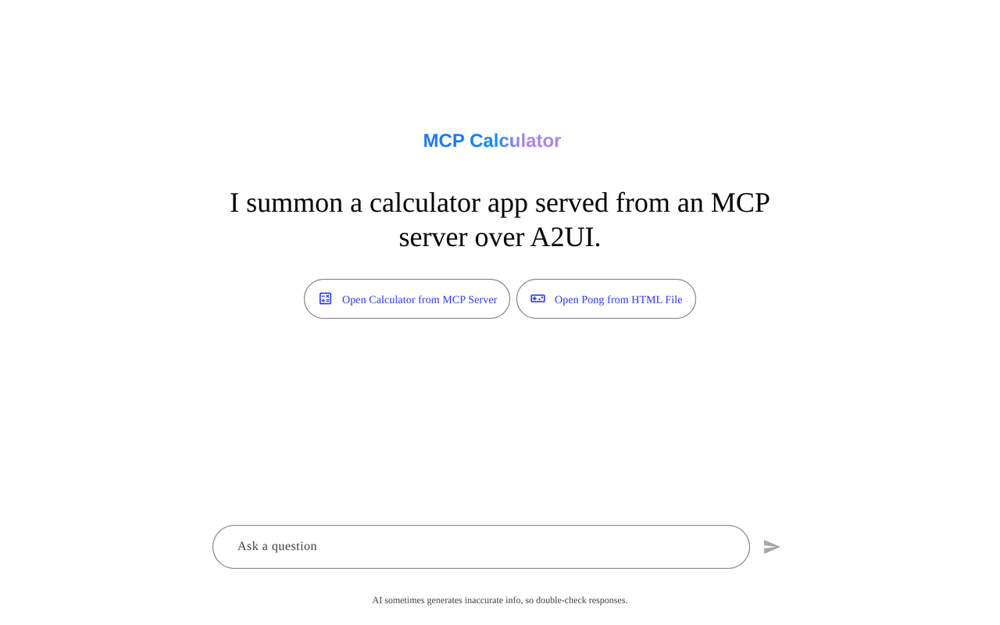
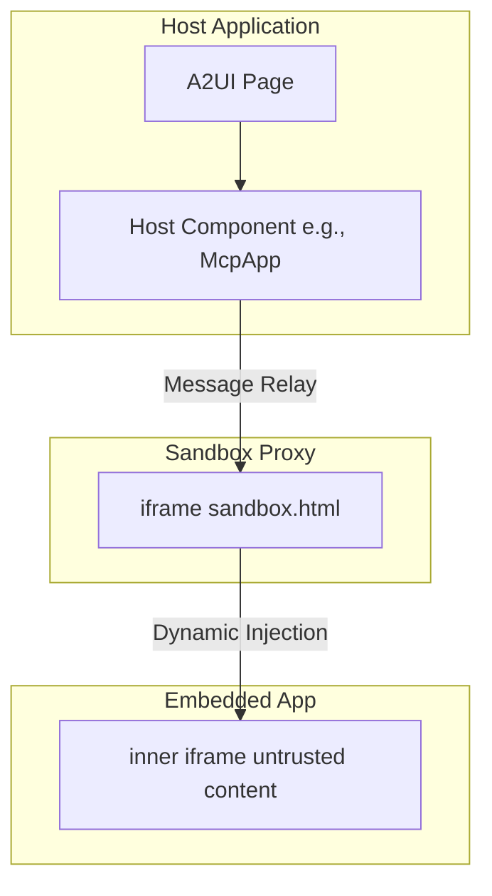
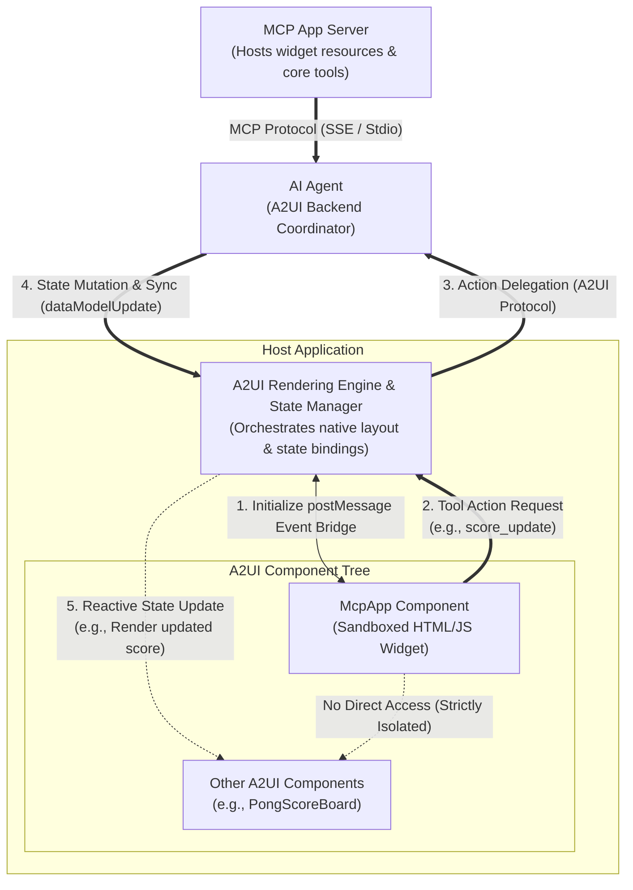

# A2UI Surface 안의 MCP Apps 통합

이 가이드는 **Model Context Protocol (MCP) Applications**가 **A2UI** surface 안에 통합되고 표시되는 방식과 보안 모델, 테스트 지침을 설명합니다.

> NOTE: 핵심 A2UI-over-MCP 프로토콜을 찾고 있나요? MCP tool 호출에서 A2UI JSON payload를 반환하는 방법은 [A2UI over MCP](a2ui_over_mcp.md)를 참고하세요.

## 개요

Model Context Protocol(MCP)은 MCP 서버가 풍부하고 인터랙티브한 HTML 기반 사용자 인터페이스를 host에 전달할 수 있게 합니다. A2UI는 이러한 서드파티 애플리케이션을 실행하기 위한 안전한 환경을 제공합니다.



## Double-Iframe 격리 패턴

신뢰할 수 없는 서드파티 코드를 안전하게 실행하기 위해 A2UI는 **double-iframe** 격리 패턴을 사용합니다. 이 접근 방식은 구조화된 JSON-RPC 채널을 유지하면서 raw DOM injection을 메인 애플리케이션에서 격리합니다.

### 보안 근거

`allow-scripts`를 사용하는 표준 single-iframe sandboxing은 `allow-same-origin`과 결합되면 우회되는 경우가 많으며, 이는 컨테이너화를 무력화합니다. `allow-scripts`와 `allow-same-origin`이 모두 있는 iframe은 부모 DOM과 프로그래밍 방식으로 상호작용하거나 자신의 sandbox 속성을 제거해 sandbox를 탈출할 수 있습니다.

이를 방지하기 위해 A2UI는 서드파티 애플리케이션이 실행되는 inner iframe에서 `allow-same-origin`을 엄격히 제외합니다.

### 아키텍처

1.  **[Sandbox Proxy (`sandbox.html`)](https://github.com/a2ui-project/a2ui/blob/main/samples/client/shared/mcp_apps_inner_iframe/sandbox.html)**: 동일 origin에서 제공되는 중간 `iframe`입니다. raw DOM injection을 메인 앱에서 격리하면서 구조화된 JSON-RPC 채널을 유지합니다.
    - 권한: host template에서는 **sandbox를 적용하지 마세요**. 예: [`mcp-app.ts`](https://github.com/a2ui-project/a2ui/blob/main/samples/community/client/lit/mcp-apps-in-a2ui-sample/mcp-app.ts) 또는 [`mcp-apps-component.ts`](https://github.com/a2ui-project/a2ui/blob/main/samples/community/client/lit/mcp-apps-in-a2ui-sample/ui/custom-components/mcp-apps-component.ts).
    - Host origin 검증: 메시지가 예상한 host origin에서 왔는지 검증합니다.
2.  **Embedded App(Inner Iframe)**: 가장 안쪽의 `iframe`입니다. 제한된 권한으로 `srcdoc`을 통해 동적으로 주입됩니다.
    - 권한: `sandbox="allow-scripts allow-forms allow-popups allow-modals"`(`allow-same-origin`, `allow-top-navigation`, `allow-top-navigation-by-user-activation`은 **반드시 포함하면 안 됩니다**).
    - 격리: unique origin으로 인해 `localStorage`, `sessionStorage`, `IndexedDB`, 쿠키 접근이 제거됩니다.
    - 최상위 윈도 하이재킹 방어: `allow-top-navigation`과 `allow-top-navigation-by-user-activation`을 제외하면, 내장된 스크립트가 frame busting 공격(예: `window.top.location = "..."`)으로 host 윈도를 다른 곳으로 리디렉션하는 것을 막을 수 있습니다.
    - 하이퍼링크를 통한 데이터 유출 방어: `allow-popups`를 제외하고 링크 내비게이션을 가로채면, 신뢰할 수 없는 콘텐츠가 새로 열린 윈도로 유도하는 클릭재킹을 통해 데이터를 빼내는 것을 막을 수 있습니다.

### 물리적 Iframe 중첩



### End-to-End 아키텍처와 Lifecycle Flow

전체 주기에는 layout tree 계층, 완전히 분리된 backend actor(Proxy Agent와 MCP Server), 그리고 격리된 서드파티 위젯이 native sibling(예: Pong 게임의 scoreboard)과 반응적으로 상호작용하는 방식이 포함됩니다.



#### Sibling Update Loop의 동작 방식

1. **postMessage 이벤트 브리지 초기화(1)**: host shell이 double-iframe sandbox를 인스턴스화하고 `McpApp` 컴포넌트와 안전한 message relay bridge를 설정합니다.
2. **Tool Action Request(2)**: 사용자가 sandboxed app과 상호작용하면(예: Pong 게임에서 점수를 냄), app은 postMessage bridge를 통해 메시지를 post하여 tool action을 트리거합니다.
3. **Action Delegation(3)**: host layout engine이 action을 가로채 A2UI/A2A 프로토콜을 통해 `AI Proxy Agent`에 실행을 위임합니다. 외부 계산이나 리소스가 필요하면 agent는 표준 MCP Protocol(SSE / Stdio)을 사용해 `MCP App Server`와 선택적으로 조정합니다.
4. **상태 변경 및 동기화(4)**: agent가 action을 처리하고 master session state를 변경한 뒤 host state manager로 `dataModelUpdate`를 push합니다.
5. **Reactive State Update(5)**: host가 로컬 store를 업데이트하여 해당 state path에 바인딩된 sibling A2UI 컴포넌트(예: native scoreboard 또는 display)의 반응형 업데이트를 트리거합니다. sandboxed 컴포넌트와 native sibling 요소 사이의 직접 통신은 컨테이너화 보안을 유지하기 위해 엄격히 차단됩니다.

## 사용법 / 코드 예시

MCP Apps 컴포넌트는 일반적으로 A2UI 카탈로그의 `custom` 노드로 해석됩니다. 개발자가 코드에서 이를 사용하는 방식은 다음과 같습니다.

### 1. 카탈로그에 등록

애플리케이션 카탈로그에 컴포넌트를 등록해야 합니다. 예를 들어 Angular에서는 다음과 같습니다.

```typescript
import {Catalog} from '@a2ui/web_core/v0_9';
import {z} from 'zod';
import {McpApp} from './mcp-app';
import {Button} from './button';
import {Snackbar} from './snackbar';

const McpAppSchema = z.object({
  content: z.union([z.string(), z.object({id: z.string()})]).optional(),
  allowedTools: z.array(z.string()).optional(),
  title: z.string().optional(),
});

export const DEMO_CATALOG = new Catalog(
  'my_app.org/some_catalog.json',
  [
    {name: 'McpApp', component: McpApp, schema: McpAppSchema},
    {
      name: 'Button',
      component: Button,
      schema: z.object({
        label: z.string(),
        action: z.any().optional(),
      }),
    },
    {
      name: 'Snackbar',
      component: Snackbar,
      schema: z.object({
        message: z.string(),
        durationMs: z.number().default(3000),
      }),
    },
  ]
);
```

### 2. A2UI 메시지에서 사용

Host 또는 Agent context에서 이 custom node로 변환되는 A2UI 메시지를 보냅니다.

```json
{
  "type": "custom",
  "name": "McpApp",
  "properties": {
    "content": "<h1>Hello, World!</h1>",
    "title": "My MCP App"
  }
}
```

content가 복잡하거나 인코딩이 필요하다면 URL-encoded 문자열을 전달할 수 있습니다.

```json
{
  "type": "custom",
  "name": "McpApp",
  "properties": {
    "content": "url_encoded:%3Ch1%3EHello%2C%20World!%3C%2Fh1%3E",
    "title": "My MCP App"
  }
}
```

## 통신 프로토콜

Host와 embedded inner iframe 사이의 통신은 `postMessage` 위의 구조화된 JSON-RPC 채널을 통해 이루어집니다.

- **Events**: Host Component는 proxy에서 오는 `SANDBOX_PROXY_READY_METHOD` 메시지를 수신합니다.
- **Bridging**: `AppBridge`가 메시지 relay를 처리합니다. 개발자, 특히 신뢰할 수 없는 iframe 안의 MCP App 개발자는 `bridge.callTool()`을 사용해 MCP 서버의 tool을 호출할 수 있습니다.
- **The Host**: 콜백을 해석합니다(예: 특정 resizing, Tool 결과).

### 제한 사항

가장 안쪽 iframe에서 `allow-same-origin`이 엄격히 생략되므로 다음 조건이 적용됩니다.

- MCP app은 `localStorage`, `sessionStorage`, `IndexedDB`, 쿠키를 **사용할 수 없습니다**. 각 애플리케이션은 unique origin에서 실행됩니다.
- parent의 직접 DOM 조작은 차단됩니다. 모든 상호작용은 message passing을 통해 진행해야 합니다.

## 사전 요구사항

샘플을 실행하려면 다음이 설치되어 있어야 합니다.

- **Python 3.10+** — agent와 MCP server backend에 필요
- **[uv](https://docs.astral.sh/uv/)** — 빠른 Python 패키지 관리자(모든 Python 샘플 실행에 사용)
- **Node.js 18+** 및 **Yarn** — 이 모노레포 워크스페이스 안에서 샘플 client app을 빌드하고 실행하는 데 필요합니다.
- **`GEMINI_API_KEY`** — 모든 ADK 기반 agent에 필요. [Google AI Studio](https://aistudio.google.com/apikey)에서 받을 수 있습니다.

!!! note ""
    **패키지 매니저 사용:** A2UI 저장소 안에 내장된 샘플 애플리케이션을 실행하려면 Corepack workspace로 구성된 Yarn이 필요합니다. 이 저장소 밖에서 여러분만의 일반적인 용도나 독립 프로젝트에 사용할 때는 원하는 패키지 매니저(예: npm, pnpm)를 사용하세요.

> ⚠️ **환경 변수 설정**: shell에서 `GEMINI_API_KEY`를 export하거나 각 agent 디렉터리에 `.env` 파일을 만들 수 있습니다. agent는 `dotenv`를 사용해 `.env` 파일을 자동으로 로드합니다.
>
> ```bash
> # Option 1: Export in shell
> export GEMINI_API_KEY="your-api-key-here"
>
> # Option 2: Create .env file in the agent directory
> echo 'GEMINI_API_KEY=your-api-key-here' > .env
> ```

## 샘플

MCP Apps 통합을 보여 주는 주요 샘플은 두 개입니다. 각 샘플은 **여러 터미널**을 필요로 합니다. backend service마다 하나, client용으로 하나가 필요합니다.

---

### 샘플 1: MCP App Standalone Sample(Lit Client & ADK Agent)

이 샘플은 Lit 기반 client와 ADK 기반 A2A agent로 sandbox를 검증합니다.

#### Step 1: Agent 시작

별도 터미널에서 agent 디렉터리로 이동해 agent를 시작합니다.

```bash
cd samples/agent/adk/mcp-apps-in-a2ui-sample
uv run agent.py
```

agent는 `http://localhost:8000`에서 실행됩니다.

#### Step 2: Client 시작

새 터미널에서 client 디렉터리로 이동해 dev server를 시작합니다(Lit renderer를 먼저 빌드해야 합니다).

```bash
cd samples/client/lit/mcp-apps-in-a2ui-sample
yarn install
yarn dev
```

client는 `http://localhost:5173/`에서 시작됩니다.

#### Step 3: Browser에서 열기

브라우저를 열고 `http://localhost:5173/`로 이동합니다. MCP App을 로드하는 A2UI 인터페이스가 표시되어야 합니다.

**예상 결과**: sandboxed iframe 안에서 MCP App을 로드하는 페이지입니다. iframe 내부의 "Call Agent Tool" 버튼을 클릭하면 agent가 처리하는 action이 트리거됩니다.

---

### 샘플 2: MCP Apps(계산기 + Pong) (Angular 클라이언트 + MCP Server + Proxy Agent)

이 샘플은 Angular 기반 client, MCP Proxy Agent, 원격 MCP Server로 sandbox를 검증합니다. **세 개**의 backend process가 필요합니다.

#### Step 1: MCP Server(Calculator) 시작

```bash
cd samples/community/mcp/mcp-apps-calculator/
uv run .
```

MCP server는 SSE transport를 사용해 `http://localhost:8000`에서 시작됩니다(포트 8000이 사용 중이라면 다른 포트에서 시작됩니다. 예: `uv run . --port 8001`).

#### Step 2: MCP Apps Proxy Agent 시작

**새 터미널**에서 다음을 실행합니다.

```bash
cd samples/community/agent/adk/mcp_app_proxy/
export GEMINI_API_KEY="your-key"  # or use a .env file
uv run .
```

proxy agent는 기본적으로 `http://localhost:10006`에서 시작됩니다.

#### Step 3: Angular Client 빌드 및 시작

먼저 **저장소 루트 디렉터리**에서 `yarn build:all`을 실행해 renderer package를 빌드합니다.

```bash
# Run at repository root
yarn build:all
```

그런 다음 **새 터미널**에서 client 디렉터리로 이동해 로컬 의존성을 설치하고 앱을 시작합니다(sandbox iframe proxy를 자동으로 번들링하고 개발 서버를 시작합니다).

```bash
# Navigate to the client directory
cd samples/community/client/angular/

# Install local dependencies
yarn install

# Start the app and bundle sandbox
yarn start mcp_calculator
```

> ⚠️ **`yarn build:all`이 필요합니다**: `yarn build:all`은 Angular app이 의존하는 A2UI renderer package를 컴파일합니다. `yarn start mcp_calculator`를 실행하면 서버를 시작하기 전에 sandbox proxy가 Angular 프로젝트의 public assets로 자동으로 번들링됩니다.

client는 `http://localhost:4200/`에서 시작됩니다.

#### Step 4: Browser에서 열기

다음으로 이동합니다.

```
http://localhost:4200/?disable_security_self_test=true
```

**예상 결과**: calculator app 또는 pong app을 로드하는 smart chip 집합이 렌더링됩니다. 두 app 모두 각자의 sandboxed iframe에서 실행됩니다.

|                                                 Calculator App                                                 |                                 Pong App                                  |
| :------------------------------------------------------------------------------------------------------------: | :-----------------------------------------------------------------------: |
|  |  |

---

## 테스트용 URL 옵션

테스트 목적으로 특정 URL query parameter를 사용해 security self-test를 opt-out할 수 있습니다.

### `disable_security_self_test=true`

이 query parameter를 사용하면 iframe 격리를 검증하는 security self-test를 우회할 수 있습니다. double-iframe 설정이 엄격한 origin check를 통과하지 못할 수 있는 디버깅 및 테스트 환경(예: `localhost` 개발)에서 유용합니다.

사용 예:

```
http://localhost:4200/?disable_security_self_test=true
```

## 문제 해결

| 문제                                              | 해결 방법                                                                                         |
| ------------------------------------------------- | ------------------------------------------------------------------------------------------------- |
| `GEMINI_API_KEY environment variable not set`     | 키를 export하거나 agent 디렉터리에 `.env` 파일을 추가합니다.                                      |
| `restaurant_finder` agent의 Python version error | Python 3.13+를 설치합니다(해당 샘플의 `pyproject.toml`에서 요구).                                 |
| `yarn build:renderer` fails                       | 먼저 `samples/client/lit/`에서 `yarn install`을 실행했는지 확인합니다.                            |
| Angular client shows blank page                   | `yarn start` 전에 `yarn build:sandbox`를 실행했는지 확인합니다.                                    |
| MCP app iframe doesn't load                       | MCP server(port 8000)와 proxy agent(port 10006)가 모두 실행 중인지 확인합니다.                    |
| `ng serve` not found                              | `yarn install`을 실행해 `@angular/cli`를 포함한 dev dependency를 설치합니다.                       |
| "URL with hostname not allowed"                   | Angular 21은 허용 host를 제한합니다. 기본값인 `localhost`를 사용하고 `--host 0.0.0.0`은 넘기지 마세요. |
| Security self-test fails in dev                   | URL에 `?disable_security_self_test=true`를 추가합니다.                                             |
