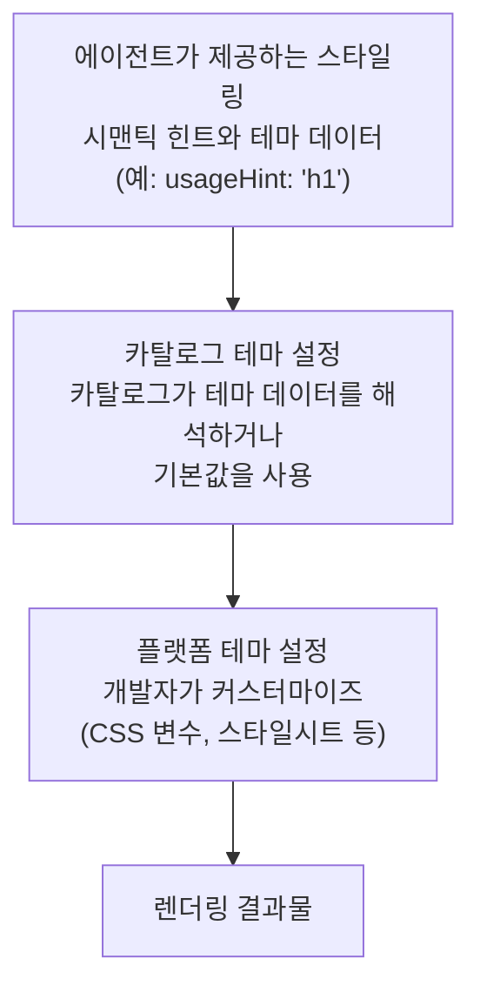

# 테마 및 스타일링

브랜드에 맞게 A2UI 컴포넌트의 룩앤필(look and feel)을 커스터마이징하세요.

## A2UI 스타일링 철학

A2UI는 기본적으로 **렌더러 제어 스타일링** 방식을 따르지만, 카탈로그를 통해 유연성도 허용합니다:

- **에이전트는 *무엇을* 보여줄지** 설명합니다(컴포넌트 및 구조).
- **렌더러는 어떻게 보일지** 결정합니다(색상, 폰트, 간격 등).

다만 필요한 경우 에이전트가 스타일링에 영향을 줄 수 있을 만큼 프로토콜은 충분히 유연하게 설계되어 있습니다.

## 스타일링 계층

A2UI 스타일링은 계층적으로 작동합니다:



## 에이전트가 제공하는 스타일링 정보

### 시맨틱 힌트

에이전트는 렌더링을 가이드하기 위해 시각적 스타일이 아닌 시맨틱 힌트를 제공합니다. _basic catalog_에서는 다음과 같습니다.

```json
{
  "id": "title",
  "component": {
    "Text": {
      "text": {"literalString": "환영합니다"},
      "usageHint": "h1"
    }
  }
}
```

**공통 `usageHint` 값:**

- Text: `h1`, `h2`, `h3`, `h4`, `h5`, `body`, `caption`
- 다른 컴포넌트들도 각자의 힌트를 가지고 있습니다 ([컴포넌트 레퍼런스](../reference/components.md) 참조).

카탈로그 요소들은 이러한 시맨틱 힌트를 대상 플랫폼의 실제 컴포넌트에 매핑하고 스타일을 적용합니다.

### `theme` 속성

A2UI 프로토콜은 `createSurface` 메시지에서 임의의 `theme` 속성을 허용합니다. 현재 이 속성은 Zod 스키마에서 `z.any().optional()`로 정의되어 있으며, 이는 에이전트가 클라이언트 렌더러와 카탈로그가 이해할 수 있는 어떤 JSON 구조든 전달할 수 있음을 의미합니다.

- 스키마 정의는 [server-to-client.ts](../../../renderers/web_core/src/v0_9/schema/server-to-client.ts)를 참고하세요.
- `Catalog` 클래스와 `themeSchema`는 [catalog/types.ts](../../../renderers/web_core/src/v0_9/catalog/types.ts)를 참고하세요.

**참고:** _basic catalog_ 컴포넌트는 에이전트로부터 전달된 `theme`를 사용하도록 연결되어 있지 않습니다.

_이 설계에 의견을 주고 싶으신가요? 여기에서 이야기해 주세요: [#1118](https://github.com/a2ui-project/a2ui/issues/1118)._

## 카탈로그 테마 설정

테마 설정은 카탈로그 구현의 책임입니다. 각 카탈로그는 원하는 어떤 테마 설정 방식이든 제공할 수 있습니다. 예를 들어 기본 제공되는 _basic catalog_는 다음과 같이 처리합니다.

### 웹 Basic Catalog 테마 설정

웹에서는 기본 A2UI 렌더러가 제공하는 _basic catalog_가 CSS 변수를 오버라이드하는 방식으로 테마가 적용됩니다.

Basic catalog 컴포넌트는 이러한 변수의 기본값을 담은 작은 스타일시트를 삽입합니다. 이 스타일시트는 `:where(:root)`를 대상으로 하므로 명시도(specificity)가 최소화되어, 호스트 앱이 쉽게 오버라이드할 수 있습니다.

예를 들어 primary color를 오버라이드하려면 앱의 CSS에 다음을 추가하기만 하면 됩니다.

```css
:root {
  --a2ui-color-primary: #ff5722;
}
```

기본 스타일은 [default.ts](../../../renderers/web_core/src/v0_9/basic_catalog/styles/default.ts)에서 확인할 수 있습니다.

**플랫폼별 예시:**

- [Lit 샘플](../../../samples/client/lit)
- [Angular 샘플](../../../samples/client/angular)
- [React 샘플](../../../samples/client/react)

### 컴포넌트별 오버라이드

전역 테마 설정 외에도, _basic catalog_의 각 컴포넌트는 모양을 더 세밀하게 조정할 수 있는 커스텀 변수를 노출합니다. 예를 들어 `Card` 컴포넌트는 `--a2ui-card-background` 변수를 노출합니다.

각 컴포넌트가 어떤 변수를 노출하는지는 해당 컴포넌트의 문서를 확인하세요.

## 주요 스타일링 기능

### 다크 모드

기본 웹 렌더러는 시스템 설정(`prefers-color-scheme`)에 따른 자동 다크 모드를 지원합니다.

다크 모드나 라이트 모드를 항상 강제하고 싶다면(또는 프로그래밍 방식으로 전환을 제어하려면), 생성된 코드의 상위 요소에 `a2ui-light` 또는 `a2ui-dark` 클래스명을 사용하세요.

### 커스텀 폰트

폰트는 다른 웹 애플리케이션과 마찬가지로 로드할 수 있습니다. _basic catalog_ 컴포넌트는 기본적으로 컨테이너의 폰트 패밀리를 상속하려고 시도하지만, 제목과 monospace 텍스트 블록에 다른 폰트를 지정할 수 있도록 `--a2ui-font-family-title`과 `--a2ui-font-family-monospace`라는 두 가지 오버라이드 가능한 값을 제공합니다.

## Flutter

Flutter는 테마 설정을 기본으로 지원합니다. 참고 자료:

- Flutter 공식 문서의 [색상과 폰트 스타일 공유를 위한 테마 사용법](https://docs.flutter.dev/cookbook/design/themes)

## 베스트 프랙티스

### 1. 시각적 속성이 아닌 시맨틱 힌트를 사용하세요

컴포넌트를 정의할 때 에이전트는 시각적 스타일이 아닌 시맨틱 힌트(`usageHint`)만 제공해야 합니다:

```json
// ✅ 좋은 예: 시맨틱 힌트 사용
{
  "component": {
    "Text": {
      "text": {"literalString": "환영합니다"},
      "usageHint": "h1"
    }
  }
}

// ❌ 나쁜 예: 시각적 속성 사용 (지원되지 않음)
{
  "component": {
    "Text": {
      "text": {"literalString": "환영합니다"},
      "fontSize": 24,
      "color": "#FF0000"
    }
  }
}
```

### 2. 접근성 유지

- 충분한 색상 대비 보장 (WCAG AA: 일반 텍스트 4.5:1, 큰 텍스트 3:1)
- 스크린 리더 테스트 수행
- 키보드 탐색 지원
- 라이트 및 다크 모드 모두에서 테스트

### 3. 디자인 토큰(Design Tokens) 활용

색상, 간격 등 재사용 가능한 디자인 토큰을 정의하고, 일관성을 위해 전체 스타일에서 이를 참조하세요.

### 4. 크로스 플랫폼 테스트

- 모든 대상 플랫폼(웹, 모바일, 데스크톱)에서 테마를 테스트하세요.
- 라이트 및 다크 모드 모두 확인하세요.
- 다양한 화면 크기와 방향을 확인하세요.
- 플랫폼 간 일관된 브랜드 경험을 보장하세요.

## 다음 단계

- **[나만의 카탈로그 정의하기](defining-your-own-catalog.md)**: 나만의 스타일로 커스텀 컴포넌트 빌드
- **[컴포넌트 레퍼런스](../reference/components.md)**: 모든 컴포넌트의 스타일링 옵션 확인
- **[클라이언트 설정](client-setup.md)**: 앱에 렌더러 설정하기
